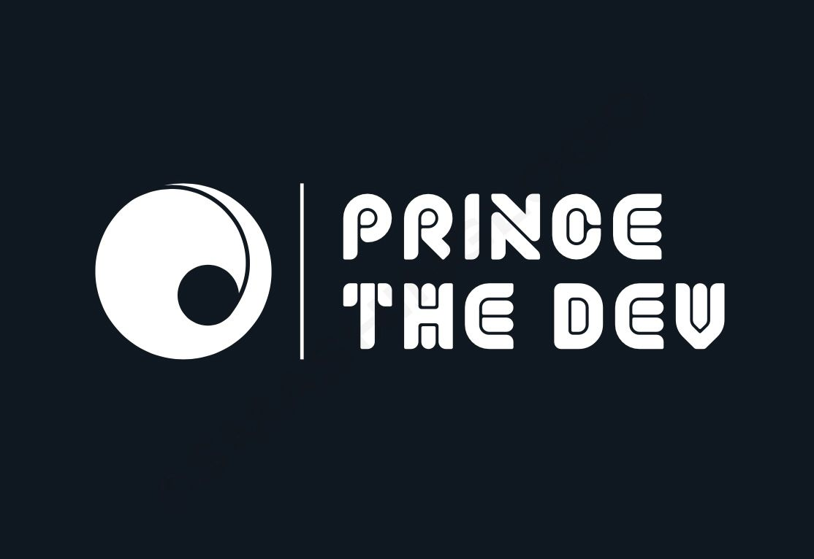

  

# 👋 Hi, I'm PrinceTheDev

### **👨‍💻 Full-Stack Software Developer**

I'm a **Full-Stack Software Developer** passionate about **continuous learning and self-development**. Starting with just basic HTML and CSS, I've completed the **ALX Software Engineering Program** and grown into a proficient full-stack softtware developer with skills across various languages and frameworks.

---

  

  

---

### **🔧 Technologies & Tools**

- **Languages:** Python, JavaScript, C, HTML, CSS-/(Sass & Scss), Typescript
- **Frameworks:** Django, React, Bootstrap, Flask, 
- **Databases:** PostgreSQL, MySQL, MongoDB, ORM
- **APIs:** RESTful API, REST Framework
- **Others:** Git, GitHub, Linux, Docker

---

### **🚀 My Journey**

From building simple static pages to developing complex web applications, my journey has been one of relentless learning and growth. Here’s a quick overview:

- **🔹 Early Days:** Basic knowledge of HTML and CSS.
- **🔹 ALX Program:** Became a certified Full-Stack Developer.
- **🔹 Now:** Proficient in Python, Django, JavaScript, React, C, and more.

---

### **🌍 What Drives Me**

Building impactful applications that can **change the world or society around me** is what keeps me pushing boundaries. I’ve been involved in various projects, both personal and team-based, where I’ve contributed as both a backend and frontend developer.

---

### **📈 My GitHub Stats**

---

<!-- ### **💼 My Projects**

  Here are a few projects that showcase my skills:

  **[Project Name](#)** - Description of what the project is, technologies used, and your role.
- **[Project Name](#)** - Description of what the project is, technologies used, and your role.
- **[Project Name](#)** - Description of what the project is, technologies used, and your role.
---
-->

### **📫 How to Reach Me**

- **LinkedIn:** [https://www.linkedin.com/in/prince-uchendu/](#)
- **Twitter:** [https://x.com/PrinceTheDev](#)
- **Instagram:** [https://www.instagram.com/princethe.dev/](#) 

---

### **📚 Continuous Learning**

I’m constantly learning and exploring new technologies. I believe that there’s always something new to learn and that’s what makes this field so exciting!

---

### **⭐️ GitHub Highlights**

- **Top Languages:** [Your Top Languages](https://github-readme-stats.vercel.app/api/top-langs/?username=PrinceTheDev&layout=compact&theme=radical)
- **Contributions:** 

---

### **⚡ Fun Fact**

When I’m not coding, you’ll find me reading books, working out, or finding new ways to challenge myself!

---
<h3 align="left">Connect with me:</h3>

  
  
  

<h3 align="left">Languages and Tools:</h3>

  
  
  
  
  
  
  
  
  
  
  

  

  &nbsp;

  

